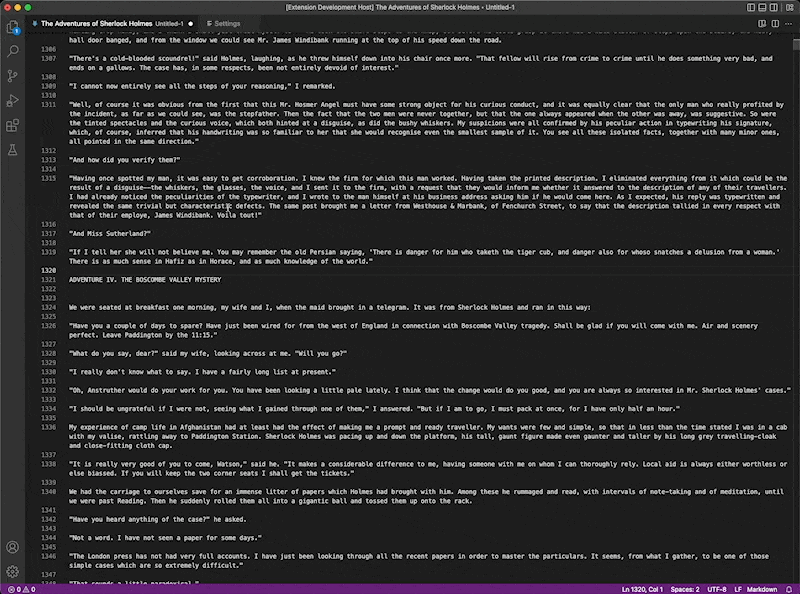

A VSCode version of NotePad++'s Style Tokens. Highly recommended to set hotkeys to maximize this extension.

## Features:
- Fast Searching
- Customizable Styles
- Case Sensitivity
- Hotkeys for All Actions!

## Extension Settings:
Settings for Styles can be found in the settings pane under 'Style Token'

Hotkeys:
- Add Styles: this adds the style to the current selection
- Set Styles: this replaces all highlighted styles with the current selection
- Remove Styles: this removes all highlights for the style
- Find Previous Style: finds the previous position for the style. Wraps to the end.
- Find Next Style: finds the next position for the style. Wraps to the beginning.

## Planned Features:
- Regex match
- Bookmark
- Find style using text from clipboard
## Known Issues:
- Styles are lost when switching between activeEditors
- Styles are not removed when closing the activeEditor